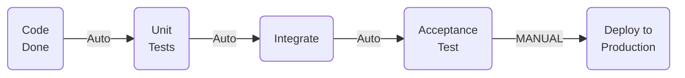
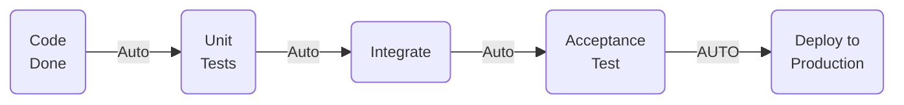

#### Cos'è la Continuous Delivery
"*Your team prioritizes keeping the software deployable over working on new features*" (Martin Fowler)

La Continuous Delivery è il passo successivo alla Continuous Integration:
- **Ogni cambiamento** al sistema **può potenzialmente essere rilasciato in produzione**
- Il rilascio può essere fatto in ogni momento in ogni ambiente (**premendo un bottone**)

| **_Tipologie Continuous_** | **_Definizione_**                                                                                                                                                                                                                                                                                                                                                                                                                                                         |
| -------------------------- | ------------------------------------------------------------------------------------------------------------------------------------------------------------------------------------------------------------------------------------------------------------------------------------------------------------------------------------------------------------------------------------------------------------------------------------------------------------------------- |
| Continuous Delivery        | Un insieme di pratiche progettate per assicurare che il codice sia sempre pronto per essere rilasciato rapidamente e in modo sicuro, attraverso tutto il suo ciclo di vita fino all'esercizio, realizzato passando prima gli eseguibili in un ambiente simile a quello di produzione ed effettuando test automatizzati per rilevare problemi.                                                                                                                             |
| Continuous Deployment      | Una estensione del concetto di Continuous Delivery nella quale tutte le modifiche che superano i test automatizzati vengono automaticamente passate in produzione. Il Continuous Deployment automatizza il passaggio precedente effettuato in modo manuale nel Continuous Delivery,e consente rilasci multipli giornalieri.                                                                                                                                               |
| Continuous Integration     | La pratica di mettere insieme le copie di lavoro di tutti gli sviluppatori in un'unica linea principale condivisa (un repository o blocco principale di codice) durante una giornata. In un processo automatizzato di Continuous Delivery, la Continuous Integration copre principalmente la fase di realizzazione del codice. Tipicamente la Continuous Integration si applica alle attività di integrazione, realizzazione e test del codice nell'ambiente di sviluppo. |
| Continuous Testing         | L'esecuzione di test automatici in ogni fase della Deployment pipeline. Fornisce un feedback immediato in ogni fase, al fine di mitigare i rischi. Un Continuous Testing automatizzato rappresenta un elemento chiave della Continuous Integration e del Continuous Delivery. Assicura che il codice e l'ambiente operino in modo appropriato, e che il codice rimanga in uno stato rilasciabile.                                                                      |
## Continuous Delivery != Continuous Deployment

<h3> Continuous Delivery</h3>

 
 

<h3> Continuous Deployment</h3>

### Continuous Delivery
La Continuous Integration permette di avere **feedback su problemi introdotti dagli sviluppatori**. Si focalizza sulla parte DEV e assicura che:
- Il codice compili
- Vengono eseguiti i test di unità, integrazione, accettazione e l'analisi statica.
Questo non è sufficiente per garantire la possibilità di rilasciare il prodotto ad ogni modifica perché **le attività che di solito fanno perdere più tempo** avvengono nella **fase di rilascio e test** (e nella comunicazione e la collaborazione tra DEV TEST E OPS)
### Problemi ricorrenti
- I sistemisti (OPS) aspettano molto tempo per ricevere la documentazione (*procedure di rilascio*) per effettuare il rilascio
- I tester (TEST) attendono molto tempo per effettuare le verifiche e le validazioni nella versione giusta (e di avere un ambiente funzionante)
- Il team di sviluppo (DEV) riceve segnalazioni di bug su funzionalità che sono state rilasciate da settimane
- Ci si rende conto solo alla fine dello sviluppo (troppo tardi) che l'architettura scelta non permette di soddisfare i requisiti non funzionali (DEV e OPS)
### Conseguenze
Questo porta a software che:
- Non è rilasciabile perché è stato impiegato troppo tempo per farlo entrare in un ambiente simile alla produzione
- Contiene molti difetti perché il ciclo di feedback tra il team di sviluppo e il team di testing e Operations è troppo lungo
![[Screenshot 2024-06-14 alle 20.02.03.png]]
### Misurare per migliorare
L'obiettivo è quello di **migliorare il processo** che permette di **rilasciare una modifica** al codice sorgente del processo in produzione.
Un vantaggio competitivo è dato dalla creazione di valore su tutte le attività richieste dal processo.
Una "Value Chain" è una modellazione del processo per misurare:
- **Il valore Globale**
- Il valore residuo da inserire nella "Value Chain" **(il miglioramento)**
Usare una **"Deployment Pipeline"** dà gli **stessi risultati di utilizzare una "Value Chain"** negli altri settori non software:
- Controllare le prestazioni e migliorarne l'efficienza
- "Fast is cheap": le pipeline permettono di trovare i problemi il prima possibile
![[Screenshot 2024-06-14 alle 20.14.25.png]]
### Deployment Pipeline
È la modellazione del processo di Deployment tramite una successione di fasi (*stages*) e verifiche (*gates*)
- Il passaggio da una fase all'altra viene verificato tramite il superamento di una verifica
- Il passaggio di una fase può scatenare una notifica
- È guidato dal concetto di Fail-Test
![[Screenshot 2024-06-14 alle 20.29.18.png]]
### Anatomia di una Deployment Pipeline
È composta da **stages** mappate su attività **misurabili**.
La **transazione** tra 2 stages viene definita **gate**
- Può essere **automatica** o **manuale**
- I gates scatenano il passaggio allo stage successivo
Gli stages possono essere **eseguiti in parallelo e/o in sequenza**
I **gates** possono essere multi direzionali
### Come realizzare la Continuous Delivery?
- Avere un **rapporto di lavorativo cooperativo con tutti i partecipanti**
- Utilizzare le **Deployment Pipelines** per definire il processo di build, test e deploy dell'applicazione
- Distribuire il processo di build e deploy su più ambienti

![[Screenshot 2024-06-14 alle 20.41.46.png]]
![[Screenshot 2024-06-14 alle 20.42.03.png]]
## Requisiti
- [[Integrazione Continua]]
- [[Version Contol System (VCS)]]
- [[Build Automation]]
- [[Unit Testing]]
- [[Artifact Repository]] Sistemi che permettono di gestire le dipendenze e gli artefatti prodotti dal nostro sistema
- [[Configuration Management]]: Strumenti che ci permettono di gestire la configurazione degli ambienti dove dovrà essere rilasciato il nostro software
- **Continuous Testing:** Test automatici a livello di sistema funzionali e non funzionali
- **Orchestratore**: Sistema software che ci permette di modellare le esecuzioni della pipeline

# Only Build Your Binaries Once
Eseguire il processo di build solo una volta garantisce di utilizzare lo stesso artefatto per effettuare tutte le verifiche in ogni ambiente. Questo ci garantisce che:
- L'artefatto che verrà rilasciato in produzione è esattamente lo stesso artefatto che è stato verificato e validato nelle Stages della pipeline
- È una forma di ottimizzazione. Eseguire il processo di build più volte rende la pipeline meno efficiente
Per realizzare questa pratica è consigliato avere un repository dove rilasciare gli artefatti e da cui recuperare le informazioni del commit nel VCS da cui è stato creato l'artefatto ([[Artifact Repository]])
L'artefatto generato deve essere indipendente dall'ambiente di esecuzione: è necessario tenere il codice separato dalle configurazioni che differisce tra gli ambienti

# Deploy the Same Way to Every Environment
È essenziale **utilizzare lo stesso script** per effettuare il rilascio in differenti ambienti. In questo modo lo script di rilascio sarà più solido perché verrà verificato maggiormente:
- Gli sviluppatori lo utilizzeranno per **rilasciare molto frequentemente** negli ambienti di sviluppo.
- I tester e gli analisti lo utilizzeranno per rilasciare negli ambienti di test.
- Quando verrà rilasciato in produzione lo script sarà stato eseguito molte volte e sarà più probabile che non fallirà.
Gli script sono codice e quindi devono essere gestiti nel VCS
Tenere separati dagli script le configurazioni (che saranno differenti per ogni ambiente)
Se gli ambienti di rilascio sono gestiti da altri gruppi (OPS) è necessario collaborare con questi gruppi per definire gli script di rilascio e condividerli con i DEV (VCS)
# Smoke-Test Your Deployments
Per verificare se il rilascio automatico è andato bene, prevedere l'esecuzione di smoke-test.
Gli smoke-test devono verificare anche il corretto funzionamento dei sub-system esterni (DB, altri web-services, messaging bus).
Gli smoke-test sono veloci e semplici da realizzare e permettono di far fallire velocemente la pipeline in caso di problemi.
# Deploy into a Copy of Production
Prevedere di avere a disposizione un ambiente con le stesse caratteristiche dell'ambiente di produzione.

Per essere sicuri che il deploy funzionerà, è necessario eseguire i test e gli script di rilascio in ambienti il più possibile simili all'ambiente di produzione.

L'ambiente dovrà avere:  (**Configuration Management**)
- La stessa configurazione di rete (*e dei firewall*)
- Lo stesso sistema operativo (*versioni e patching*)
- Lo stesso stack applicativo (*application server, versione db etc...*)
- I dati gestiti dall'applicazione devono essere in uno stato consistente
# Each Change Should Propagate through the Pipeline Instantly
Ogni modifica al codice sorgente deve avviare il processo di Deploy (*pipeline*).
Molto probabilmente la pipeline impiegherà tanto tempo per eseguire l'intero processo per questo è necessario inserire delle verifiche negli stages che la facciano fallire il prima possibile.
Il processo di Continuous integration non eseguirà ad ogni commit e sarà più complicato identificare l'errore. Per questo si consiglia un CI Server che possa eseguire il processo di CI a partire da uno specifico commit. In questo modo sarà più semplice effettuare attività di debug per identificare la modifica che ha fatto fallire il processo.
![[Screenshot 2024-06-15 alle 13.54.10.png]]
# If any Part of the pipeline fails, stop the line
Progettare la pipeline in moda da eseguire per primi i controlli veloci e meno esaustivi.
In questo modo sarà possibile far fallire la pipeline e notificare tutto il team (DEV, TEST, OPS) del problema.
# Benefici
- **Ridurre il rischio legato al deploy:** dal momento che si sta distribuendo piccole modifiche è meno probabile corrompere il sistema ed è più facile risolvere l'errore in caso di problemi
- **Velocizza il _time to market_:** questa pratica porta ad avere rilasci più frequenti
- **Maggiori feedback da parte degli utenti**
- **Progressi tangibili:** molti Team monitorano i progressi in un ITS. Se _DONE_ significa "gli sviluppatori dichiarano che è stato fatto" è molto meno credibile rispetto a "è fatto, verificato e distribuito in un ambiente di produzione" (o simile alla produzione).
- **Minor costo:** diretta conseguenza dell'automazione
- **Prodotti migliori:** che soddisfano le aspettative degli utenti
- **Team meno stressati e più cooperativi**
- **Maggiore documentazione implicita**
