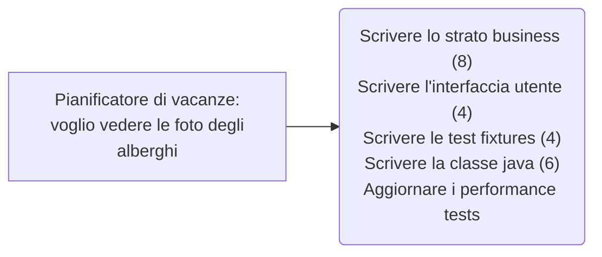

Il framework Scrum è una pratica, un modo di lavorare, fino agli anni '90 approccio **a staffetta**, che comporta svantaggi se una volta terminato il progetto ci sono delle discrepanze con l'assignment del committente.
Scrum introduce la pratica degli **Sprint**, un approccio olistico o *rugbystico*
- Scrum è un **processo agile** che nasce per sviluppo di **progetti complessi**. Permette di concentrarsi sulla consegna del *maggiore valore* business nel più *breve tempo*.
- Consente di ispezionare software funzionante rapidamente e ripetutamente (ogni 2 settimane o ogni mese).
- Il business, ossia il cliente, stabilisce le priorità. Il team si organizza di conseguenza scegliendo la strada migliore per consegnare le funzionalità a priorità più alta.
- Ogni due settimane si valuta il software funzionante e si decide se rilasciare o di migliorarlo aggiungendo un'altra fase di Sprint. 
Viene utilizzato in molteplici ambiti come software commerciale, videogames, siti web, sistemi, sistemi embedded...
#### Caratteristiche principali
- Leggero
- Facile da capire 
- Difficile da padroneggiare
Si basa su **tre pilastri**:
- **Trasparenza** (linguaggio comune per una conoscenza condivisa)
- **Controllo** (ispezioni pianificate per prevenire variazioni non desiderate)
- **Adattamento** (aggiustamenti per minimizzare ulteriori deviazioni tramite feedback continuo)
---
- I gruppi si auto-organizzano.
- Il prodotto evolve attraverso "Sprint" mensili o *di durata fissa*.
- I requisiti sono trattati come elementi di una lista delle "product backlog"
- Non vengono prescritte particolari pratiche ingegneristiche
- Si basa sull'attività empirica cioè la conoscenza si basa sull'esperienza e le decisioni si basano su ciò che è conosciuto 
- Processo iterativo e incrementale per ottimizzare il controllo dello sviluppo e il controllo del rischio.
##### Manifesto
*persone e iterazioni* più che *processi e strumenti 
software funzionante* più che *documentazione ampia* (il framework non è una giustificazione per non produrre documentazione)
*collaborazione con il cliente* più che *negoziazione del contratto
Risposta al cambiamento* più che *seguire un piano*
#### Sprint

![[scrum.png]]
I progetti Scrum progrediscono attraverso una serie di "Sprint", analoghi alle iterazioni della Extreme Programming (altra pratica agile)
- Durata tipica 2-4 settimane
- Una durata costante favorisce un ritmo migliore
- Il prodotto è progettato realizzato e testato durante lo Sprint 
- All'interno dello Sprint vengono celebrati tutti gli eventi/cerimonie

Le fasi di _requisiti_, _progetto_, _codifica_ e _test_ che si verificano nel framework **a staffetta** vengono in pratica affrontate anche nel framework Scrum, ma per ogni fase di Sprint. 
**Non si cambia durante lo Sprint**:  una volta che sono stati fissati i goal dello sprint, nel 99% dei casi nello sprint si sviluppa una certa funzionalità, se si interrompe si va ad allungare i tempi. 

![[Pasted image 20240323154500.png]]
##### Revisione e rischi Sprint 
- Lo Sprint backlog può essere chiarito e rinegoziato tra il Product Owner e il team di sviluppo non appena si conosce di più
- La durata dello Sprint assicura che il rischio di scostarsi da quanto chiesto dal product owner sia limitato alla durata dello sprint
- **Uno Sprint può essere cancellato** se lo Sprint Goal diventa obsoleto 
- **MA** avendo una durata limitata (max 1 mese) **raramente ha senso** 
### Ruoli 
##### Product owner
- Definisce caratteristiche prodotto
- Rappresenta il desidero del committente
- Decide date e contenuto del rilascio 
- È responsabile della redditività del prodotto (ROI)
- Definisce le priorità delle caratteristiche del prodotto in base al valore che il mercato gli attribuisce
- Adegua le caratteristiche e la priorità ad ogni iterazione, secondo quanto necessario
- Responsabile che il *Product Backlog* sia chiaro e ordinato
- Accetta o rifiuta i risultati del lavoro
##### Scrum Master
- Rappresenta conduzione progetto 
- Responsabile dell'adozione dei valori e delle pratiche *Scrum*
- Rimuove ostacoli
- Si assicura che gruppo di lavoro sia pienamente operativo e produttivo
- Favorisce una stretta cooperazione tra tutti i ruoli e le funzioni 
- Protegge il gruppo di lavoro da interferenze esterne
- **Servant leader:** aiuta *Product Owner* e il *Team di sviluppo* condividendo la gestione e le decisioni con il team.
##### Development team 
- Tipicamente 5-9 persone
- Responsabili di realizzare l'incremento in conformità alla *Definition of Done*
- Competenze trasversali: (*cross functional*)
	- Programmatori, tester, progettisti di user experience, ecc 
- Membri di progetto dovrebbero lavorare full-time
	- Possono esserci eccezioni (ad esempio amministratori di basi di dati)
- Il gruppo di lavoro si auto-organizza.
	- Idealmente, niente titoli, ma in rari casi può essere una possibilità
### Eventi
##### Sprint Planning
È un evento _Time boxed_, solitamente della durata di 8 ore per sprint di 1 mese
- *Cosa* può essere realizzato durante lo Sprint?
	- Il team seleziona dal product backlog gli item che può impegnarsi a completare.
- Viene creato lo Sprint backlog collaborativamente da tutto il team 
- Vengono identificati i Tasks, e ciascuno di questi viene stimato (1-16 ore)
- *Come* completare il backlog?
	- Decomposizione delle *User Story*

![[Pasted image 20240323155759.png]]
### Daily scrum (stand-up meeting)
Si tratta di un incontro giornaliero di 15 minuti, è un evento veloce che si svolge solitamente in piedi, in modo da non doversi sedere e rendere la riunione prolissa.
- Non ha finalità di risoluzione problemi, ma di sincronizzazione su quanto fatto e pianificare la giornata per il raggiungimento dello Sprint goal
- Si aggiorna la scrumboard
- Aiuta a evitare altre riunioni non necessarie 
- Solitamente si chiede
	- Cos'hai fatto ieri 
	- Cos'hai fatto oggi
	- C'è qualcosa che ti impedisce di farlo? 
**Non è un SAL** (servant leader) per lo *Scrum Master* che non partecipa. Sono impegni assunti tra pari (*Development Team*)
#### Sprint review
È sempre un evento _Time boxed_, ossia circa 4 ore per Sprint di un mese
- Il gruppo di lavoro presenta ciò che ha realizzato
- Viene validato e accettato quanto realizzato
- Tipicamente in forma di demo delle nuove caratteristiche o dell'architettura sottostante
- Informale
	- Regola delle 2 ore per la preparazione
	- Niente slide
- Partecipa tutto il gruppo  
- Tutti sono invitati (anche esterni)
#### Sprint retrospective
- Si celebra dopo la *Sprint review* e prima del prossimo *Sprint planning*
- 3h per Sprint di 1 mese
- Si valuta ciò che sta funzionando e cosa no
	- Come migliorare la qualità del prodotto?
	- La [[#Definition of Done]] è appropriata? 
	- Che miglioramenti possiamo apportare al prossimo Sprint?
- Partecipa tutto il gruppo i lavoro, è una riunione interna, il product owner è escluso. 
	- Scrum master
	- Development Team
![[Pasted image 20240323160300.png]]
### Artefatti
##### Product Backlog
- I requisiti, funzionalità, miglioramenti, fix da realizzare nei prossimi rilasci
-  Una lista di tutti i “desiderati"
- Idealmente espressa in modo che ciascun elemento ha valore per gli utenti o i clienti del prodotto
- Priorità assegnate dal Product Owner mentre il Development Team stima ogni item
- Priorità rivalutate all'inizio di ogni sprint con il Development Team
- Raffinamento continuo, è una lista dinamica che evolve con il prodotto

| Elementi del backlog                                                                                                      | Stima |     |
| ------------------------------------------------------------------------------------------------------------------------- | ----- | --- |
| Permettere ad un ospite di effettuare una prenotazione                                                                    | 3     |     |
| Come ospite, voglio cancellare una prenotazione                                                                           | 5     |     |
| Come ospite, voglio cambiare le date di una prenotazione                                                                  | 3     |     |
| Come impiegato dell'hotel, posso lanciare i report RepPAR (Revenue Per Available Room = Fatturato per camera disponibile) | 8     |     |
| Migliorare la gestione delle eccezioni                                                                                    | 8     |     |
###### User Stories
Sono gli Item che compongono il Product Backlog e andranno scomposte in Task
**Caratteristiche**:
- *Independent*:
	- Of order of user story delivery
	- Of internal and especially external dependencies
- *Negotiable*:
	- Flexible scope
	- None specific language
	- Explain the intention, not the implementation
- *Valuable*:
	- Value is clear to everyone
	- Persona matches Benefit & Goal will deliver the benefit
	- Avoid technical / role specific language
- *Estimable*:
	- Clear and concise explanation
	- Avoid technical / role specific language
- *Small*:
	- Easily fits into a Sprint, i.e. <20% of velocity
	- Definitely not > 33% of velocity
- *Testable*:
	- Can be automated
	- Avoid external testing / long test suites
![[Pasted image 20240323161026.png]]
### Sprint backlog
- Ogni componente del *Development Team* si sceglie qualcosa da fare
	- Il lavoro non è mai assegnato
- La stima del lavoro rimanente è aggiornata ogni giorno (*non è sempre vero*)
- Ogni membro del gruppo di lavoro può aggiungere, cancellare o modificare parti dello sprint backlog
- Il lavoro da svolgere durante lo sprint "*emerge*"
- Se il lavoro non è chiaro, definire un elemento dello sprint backlog con una stima temporale più ampia, e decomporlo successivamente
- Aggiornare il lavoro rimanente man mano che diventa più chiaro
- Massima visibilità della *scrumboard*
![[Pasted image 20240323161555.png]]
#### Definition of Done
Definisce il significato di "FATTO" per uno Sprint Item
- Il minimo set i attività per definire che un'attività è completata 
- Può variare per gruppo di lavoro 
- Deve essere ben chiaro per tutti i membri del gruppo di lavoro 
- È utilizzato per verificare se un'attività è da ritenersi completata 

![[Pasted image 20240323161714.png]]
#### Acceptance criteria
Permette di confermare se la storia è completa e funziona come voluto
- Frasi semplici condivise da Product Owner e Development Team
- Possono essere incluse con la User Story
- Rimuovono l'ambiguità dei requisiti
		

		<i>A user cannot submit a form without completing all the mandatory fields. information from the form is stored in the registrations database. An acknowledgment email is sent to the user after submitting the form</i>
	

![[Pasted image 20240323161757.png]]
#### Scalabilità di Scrum 
- Tipica dimensione del team è 7 (± 2) persone
	- Scalabilità gestita come “team di team”
- Fattori collegata alla scalabilità
	- Tipo di applicazione
	- Dimensione del team
	- Distribuzione del team
	- Durata del progetto
- Scrum è già stato utilizzato per progetti 500+ persone (Scrum of scrums)

$\rightarrow$ vai a [[Testing]]