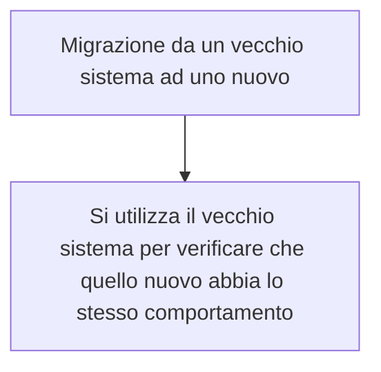

In ingegneria del Software, per *unit testing* si intende l'attività di testing **di singole unità software**. Per unità si intende normalmente il **minimo componente** di un programma dotato di **funzionamento autonomo**; a seconda del paradigma di programmazione o linguaggio di programmazione, questo può corrispondere per esempio a una **singola funzione** nella programmazione procedurale, o una **singola classe** o un **singolo metodo** nella programmazione a oggetti.
Come altre forme di testing, lo unit testing può variare completamente da "*manuale*" a automatico. Specialmente nel caso dello unit testing automati, lo sviluppo dei **test case** _(singole procedure di test)_ può essere considerato **parte integrante dell'attività di sviluppo**.

DEF:
I **Test di unità** sono del codice, **prodotto dallo sviluppatore** che esercitano un'unità del programma. Per unità si intende una **funzionalità atomica** che può essere verificata in modo isolato, in modo da assicurare che il risultato del test non sia influenzato da altre unità. Nella programmazione ad oggetti un'unità può essere uno o più metodi di una classe, o un'istanza di una classe. Nella programmazione procedurale un'unità corrisponde ad una funzione.
Vengono **sviluppati dal programmatore che sviluppa le unità, per verificare l'assenza di alcuni errori, e documentare il comportamento dell'unità prodotta.**
# Proprietà desiderabili (A TRIP)
Automatic Thorough Repeatable Independent Professional.
##### Automatic
I test di unità devono essere eseguiti automaticamente. In ogni progetto deve essere disponibile un "automazione a comando" che permetta a tutti di invocare e far eseguire tutti o una parte dei test di unità in modo semplice.
Durante la fase di sviluppo del progetto è importante che i test possano essere eseguiti:
- **in modo rapido:** I test unità devono essere semplici e la loro esecuzione non deve impiegare più di pochi secondi.
- **Senza richiedere l'interazione umana:** Se un test di unità richiede che alcuni parametri siano inseriti, ogni volta, manualmente da uno sviluppatore, questo non permetterebbe di eseguire tutti i test del progetto in modo automatico a determinate ore del giorno
- **In modo autonomo:** L'automazione che effettua l'esecuzione dei test di unità deve essere in grado di capire quando e dove i test falliscono ed avvisare gli sviluppatori. In questo modo gli sviluppatori saranno interrotti, dall'attività lavorativa, solo quando uno o più test falliranno
##### Thorough (esaustivi)
Dei buoni test di unità devono essere **esaustivi e accurati**, devono verificare il comportamento di qualsiasi parte del progetto che potrebbe creare degli errori.
Esistono degli strumenti che permettono di misurare se ogni parte del progetto è stata eseguita durante la fase di test, e possono calcolare:
- La **percentuale di righe di codice** che vengono esercitate attraverso i test di unità nel progetto
- La **percentuale di possibili diramazioni** che vengono eseguiti dai test di unità 
- Il **numero di eccezioni** che vengono controllate attraverso i test
- Altri dati che permettono di capire dove il progetto è carente di test di unità
Come si può intuire, non è detto che se in un progetto viene eseguito il 100% del codice dai test di unità questo è privo di errori.
![[Screenshot 2024-04-18 alle 17.15.46.png]]
##### Repeatable
I test di unità devono produrre sempre lo stesso risultato
Per essere ripetibili, i test di unità devono avere le seguenti caratteristiche:
- **Essere indipendenti ==dall'ordine== di esecuzione**: L'ordine di esecuzione dei test di unità non deve influenzare il risultato. Per questo è necessario che i test siano indipendenti.
- **Essere indipendenti ==dall’ambiente== di esecuzione:** L'esecuzione dei test non deve dipendere da risorse esterne al progetto o da risorse non gestite nel VCS. Se alcune unità devono utilizzare risorse esterne (*p.es database*) è consigliato utilizzare la tecnica *Mock Object* per simulare il comportamento di queste componenti.
##### Independent
I test di unità devono essere il più possibile **indipendenti dall'ambiente di esecuzione, degli elementi esterni al progetto e dall'ordine di esecuzione**. Quando si scrive un test è consigliato verificare il comportamento di un **singolo aspetto del progetto**. Questo non significa che un test di un'unità deve avere solo una asserzione, ma deve controllare solo un metodo o più metodi che realizzano un aspetto di una funzionalità del progetto.
Se il test è indipendente il suo comportamento sarà ripetibile nel tempo, perchè il suo comportamento non dipenderà dalle altre unità del progetto. La ripetibilità del test è un aspetto che permette se il test è indipendente.
![[Screenshot 2024-04-18 alle 17.39.28.png]]
##### Professional
Poichè i test di unità sono codice, devono essere **scritti e mantenuti con la stessa professionalità del codice di produzione** del progetto.
Visto che i buoni test di unità devono essere esaustivi, è ragionevole che il **numero di linee di codice** per realizzare i test sia **pari o a volte superiore** delle linee di codice in produzione.
![[Screenshot 2024-04-18 alle 17.58.07.png]]
## Caratteristiche del framework
Per creare i test di unità si sfruttano dei framework, con le seguenti caratteristiche:
- Un modo per configurare l'ambiente di esecuzione del test
- Un modo per selezionare un test o un insieme di test da eseguire
- Un modo per analizzare i valori aspettati, prodotti dalle unità
- Un modo standard per eseguire ed esprimere se il test è stato superato, se è fallito o se sono stati prodotti degli errori
#### JUnit
Un modo per configurare l'ambiente di esecuzione del test:
https://github.com/junit-team/junit4/wiki/Test-fixtures

Un modo per selezionare un test o una **suite** (*insieme di test*)
https://github.com/junit-team/junit4/wiki/Aggregating-tests-in-suites
https://github.com/junit-team/junit4/wiki/Categories

Un modo per analizzare i valori aspettati, prodotti dalle unità
https://github.com/junit-team/junit4/wiki/Assertions

Un modo standard per eseguire ed esprimere se il test è stato superato se è fallito o se sono stati prodotti degli errori
https://github.com/junit-team/junit4/wiki/Getting-started
![[Screenshot 2024-04-18 alle 18.03.31.png]]
### Cosa verificare?
Verificare se i risultati che essa produce sono corretti. Per corretti si intende che il risultato atteso sia uguale al risultato prodotto dall'unità.
Capita che i requisiti non sono chiari o possono cambiare nel tempo. In questi casi **i test di unità sono un buon punto di partenza per documentare nel codice**, come uno sviluppatore ha interpretato i requisiti e descrivere **il comportamento delle unità realizzate**.
```Java
public class Calculator{
	public int evaluate(String expression){
		int sum = 0;
		for (String summand: expression.split("\\+"))
			sum += Integer.valueOf(summand);
		return sum;
	}
}
```
```Java
import static org.junit.Assert.assertEquals;
import org.junit.Test;

public class CalculatorTest{
	@Test
	public void evaluatesExpression(){
		int sum = calculator.evaluate("1+2+3"); //è corretto 
		assertEquals(6, sum); //è corretto
	}
}
```
### Bundary Conditions (CORRECT)
Solitamente gli errori accadono in **condizioni limite.** Identificare le condizioni limite è una delle parti più importanti per creare delle buone unità:
- **C**onformance: i valori sono conformi al risultato atteso?
- **O**rdering: I valori seguono o non seguono un ordine?
- **R**ange: I valori sono all'interno di un valore di _min_ e _max_ appropriato?
- **R**eference: I valori possono provenire da codice che si riferisce a dati esterni che non sono sotto il controllo del codice?
- **E**xistence: I valori esistono (*non sono nulli, non sono zero, sono presenti in un determinato insieme?*)
- **C**ardinality: I valori sono nella quantità desiderata?
- **T**ime: I valori rispettano un ordine temporale?
Con il termine valore si fa riferimento sia ai parametri di input dei metodi di un unità, che ai dati interni all'unità e ai risultati che questa produce.
### Check Inverse Relationship
Alcune unità possono o devono essere verificati tramite l'applicazione della loro funzionalità inversa.
Esempi:
**Calcolare la radice quadrata di un numero.** Per testare se la radice quadrata è corretta è possibile elevare al quadrato il risultato ritornato dall'unità e confrontarlo con il dato di partenza.
**Inserimento di un elemento in una pila**: Il modo più semplice per verificare se l'inserimento è andato buon fine è quello di effettuare un prelevamento dalla pila e controllare che l'elemento ritornato sia l'elemento di partenza.
### Cross-check Using Other Means
Utilizzare uno strumento esistente (oracolo) per verificare se la nuova unità ha lo stesso comportamento.

#### Force error contitions
Nel mondo reale gli errori accadono. Una buona norma, per creare un buon progetto, è quello di ricreare le condizioni di errore e verificarne che il progetto funzioni come ci si aspetta in queste condizioni.

# Performance Caratteristics
I test di unità devono essere veloci perchè devono poter essere eseguiti molto spesso.
